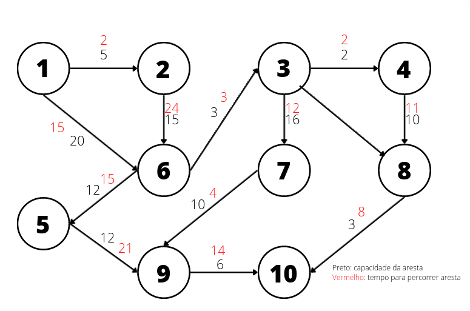

# Travel Agency - DA 2nd Project

## Build

```bash
$ mkdir build
$ cd build
$ cmake ..
$ cmake --build .
```

## Testing 

No root do projecto, executar o comando:

```bash
$ runTests.sh
```

Isto irá compilar o projecto e executar para cada um dos 7 cenários um exemplo de acordo com o grafo 10, presente na pasta `input`. <br>
Observação: nos cenários 2.2, 2.4 e 2.5 é necessário informar nome do ficheiro de input dos caminhos dados inicialmente. Para os testes, em cada cenário, é o número do teste (exemplo: "2.2").

### Representação do grafo 10:



## Help

```
./proj2 --help

Usage: /proj2 <CASE> <OPTION> <GRAPH> <ORIGIN> <DESTINATION> [GROUP SIZE]

       <CASE>
          1: Without group division between paths
          2: With group division between paths
       <OPTION>
          [1] 1: Max size of a group traveling
          [1] 2: Minimization number of bus changes vs. maximization of group size
          [2] 1: Find travel routes for a group of a determined size [GROUP SIZE]
          [2] 2: Correct travel routes in case group size increases (number of bus changes can go up) [GROUP SIZE]
          [2] 3: Calculate the max group size and travel routes between origin and destination
          [2] 4: Minimum amount of time for the whole group to arrive at destination
          [2] 5: Max amount of time a subset of the group may wait between connections (bus changes)
       <GRAPH>
          Name of the file (inside input folder) that describes the graph
       <ORIGIN>
          Path's origin node
       <DESTINY>
          Path's destination node
       [GROUP SIZE]
          Desired group size
```

## Grupo G54:

- Fábio Sá, up202007658
- Marcos Pinto, up201800177
